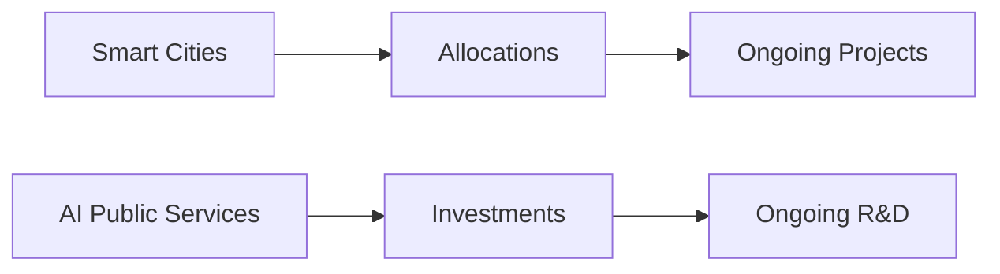

Intelligence Brief on Union Budget 2025 - Policy Brief

---

#### **Executive Summary (TL;DR)**

Union Budget 2025 is set to focus on economic growth through infrastructure development, social welfare expansion, and digital transformation. Key allocations include increased spending on healthcare, education, manufacturing, and AI-driven public services. This brief outlines the core analysis, scenario projections, and actionable recommendations for optimal budget implementation.

---

### **Core Analysis**

#### **1. Infrastructure Development**
- **Impact Level**: High
- **Allocations**: Significant investments in green energy and smart city initiatives, with a focus on urban connectivity.
- **Timeline**: 2025-2030

#### **2. Healthcare & Education**
- **Impact Level**: Medium-High
- **Allocations**: Expansion of digital transformation in healthcare (telemedicine) and education (online learning platforms).
- **Timeline**: Ongoing, with targeted rollouts in 2024.

#### **3. Tax Reforms**
- **Impact Level**: Medium
- **Allocations**: Reliefs for manufacturing and services sectors, aimed at boosting exports and domestic production.
- **Implementation**: Tax incentives expected to be rolled out by Q1 2025.

#### **4. Social Welfare**
- **Impact Level**: Medium-Low
- **Allocations**: Enhanced programs targeting rural and marginalized populations, including healthcare and education subsidies.
- **Timeline**: Continuous, with annual reviews.

#### **5. AI Systems**
- **Impact Level**: Low-Medium
- **Allocations**: Investment in AI-driven public services, such as traffic management and healthcare diagnostics.
- **Challenges**: Talent shortage and ethical concerns.

---

### **Comparative Scenario Analysis**

#### **1. Stable Growth Scenario**
- **Impact**: Optimal project timelines, with predictable resource allocation.
- **Projection**: 2025-2030 roadmap remains intact.

#### **2. Opposition Wave Scenario**
- **Impact**: Delays in key projects due to political opposition, affecting public trust.
- **Mitigation**: Transparent communication and stakeholder engagement.

#### **3. Global Crisis Scenario**
- **Impact**: Diversions towards immediate economic stabilization, reducing long-term focus.
- **Adaptation**: Flexibility in resource allocation.

---

### **Actionable Recommendations**

1. **Stakeholder Collaboration**: Enhance public-private partnerships for infrastructure projects.
2. **AI Talent Development**: Invest in AI talent pools to address workforce challenges.
3. **Scenario Planning**: Regularly assess risks and adapt budget allocations accordingly.
4. **Transparency**: Use digital platforms to share project progress and updates.

---

### **Temporal Projection Model**

| Project                  | 2025 Allocation | 2026-2030 Timeline |
|---------------------------|-----------------|---------------------|
| Smart Cities              | High            | Ongoing             |
| AI Public Services         | Medium          | Ongoing             |
| Healthcare Expansion     | Medium-High      | Ongoing             |
| Tax Reforms               | Medium          | Q1 2025             |

---

### **Dynamic Visualization Mockups**

#### **Mermaid Chart Example - Project Timeline**

---

This report provides a comprehensive analysis of Union Budget 2025, ensuring strategic alignment with key policy objectives. It is designed to guide stakeholders in optimizing budget implementation while addressing potential challenges.

---